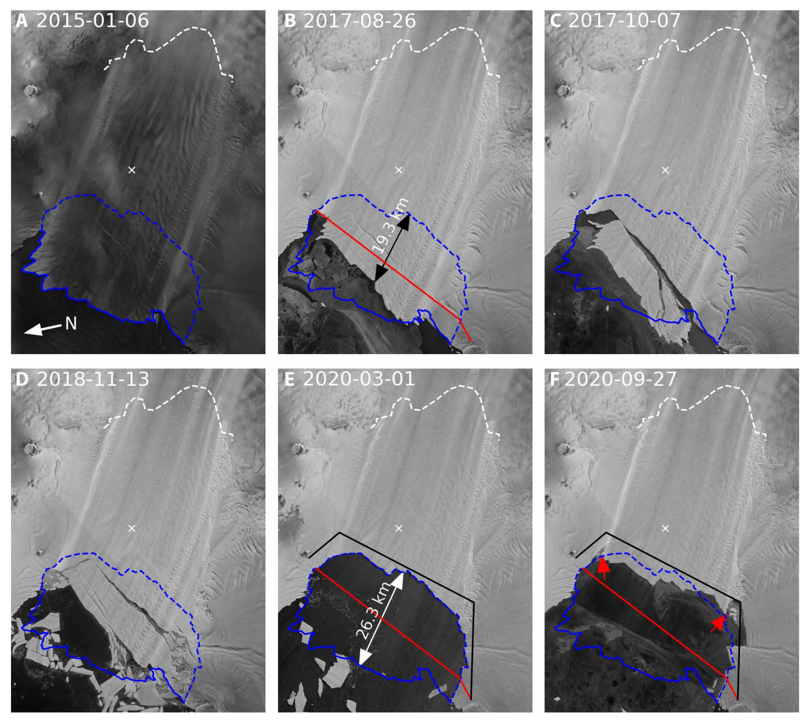
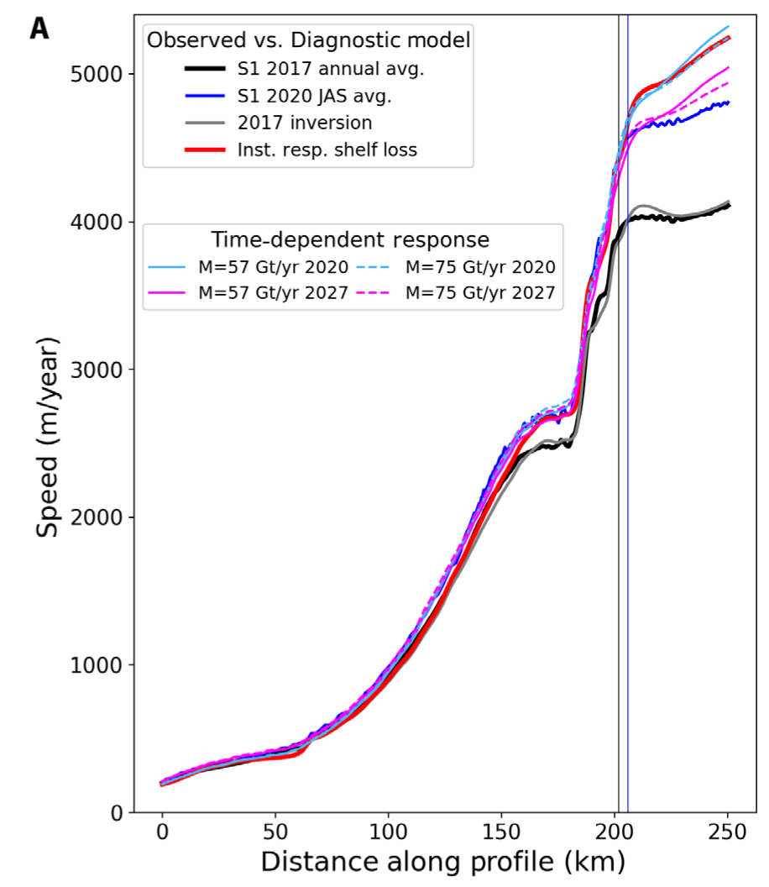
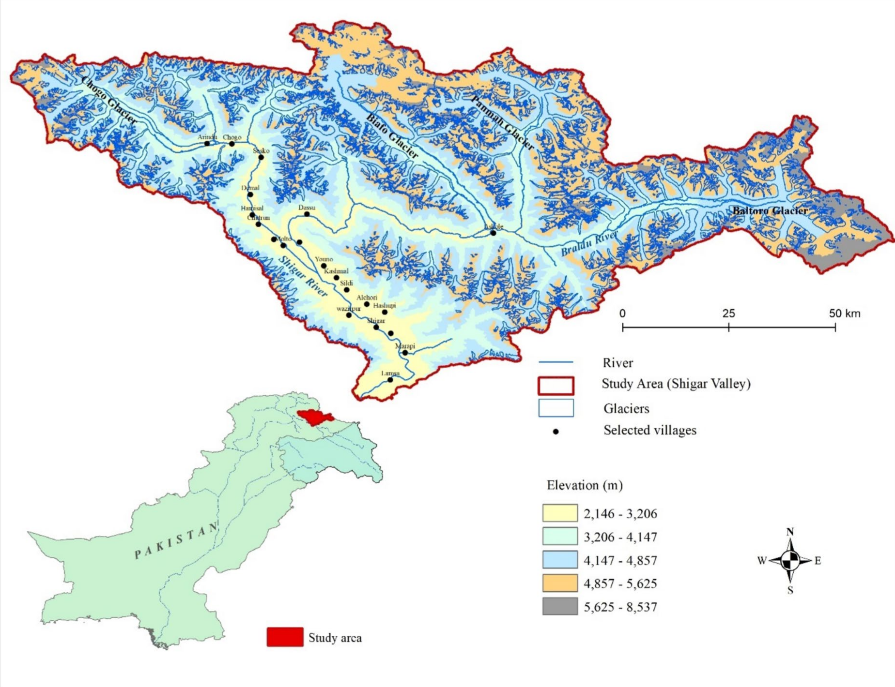
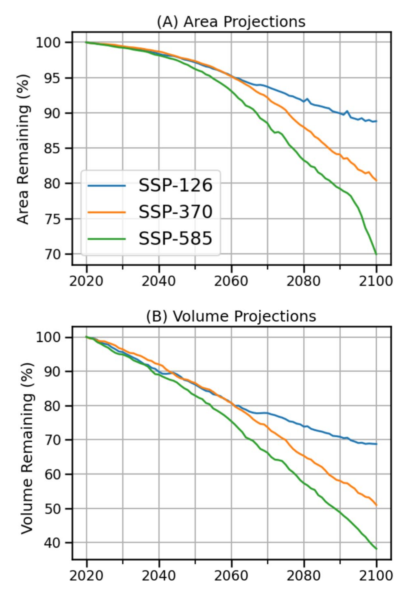
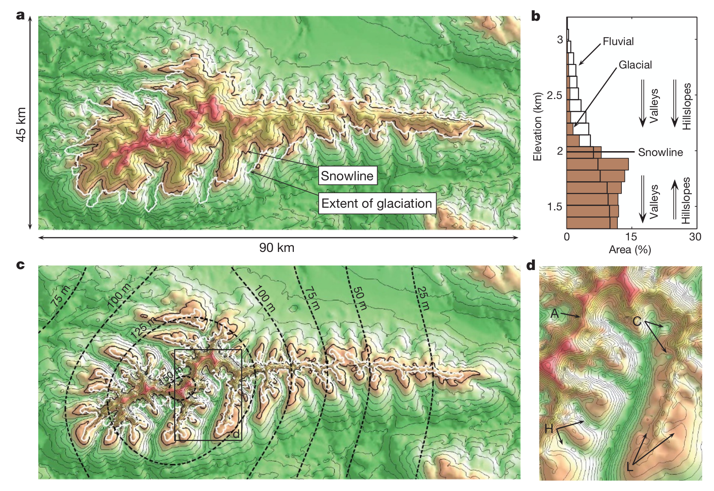
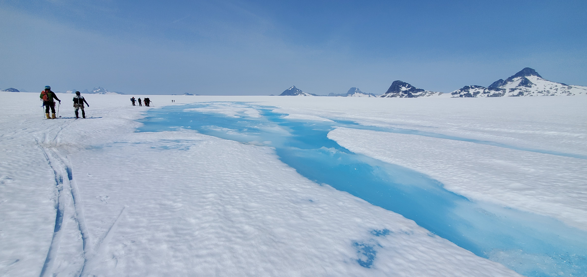
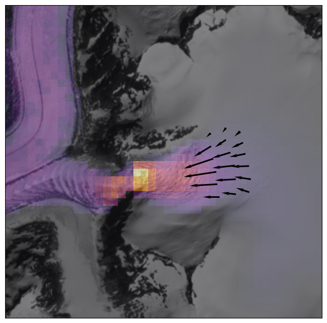
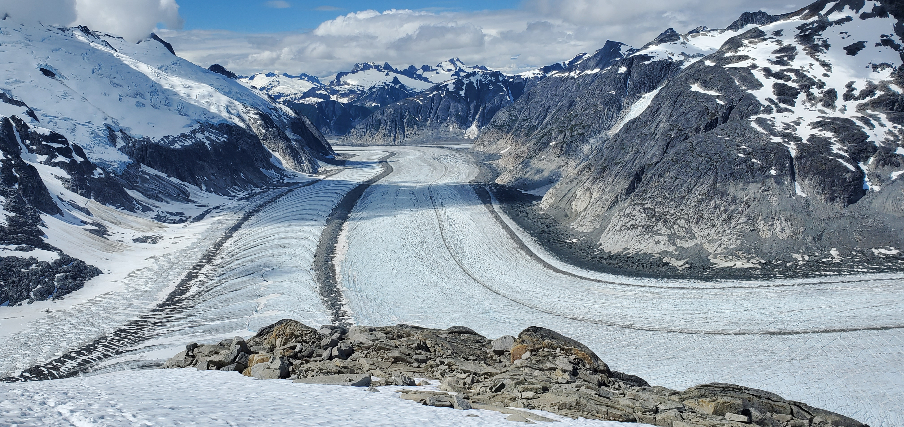

Daniel Shapero

University of Washington

Applied Physics Lab

shapero@uw.edu

----

### Big picture

* Numerical modeling in glaciology has been the domain of experts.
* **Goal**: make a tool that a bigger audience can use.

----

### Plan

* Glaciology and use of glacier models (10 min)
* The finite element method; Firedrake (20 min)
* Glacier physics (35 min)
* Icepack demonstrations (45 min)


---

# Glaciology

----

### Why: sea-level rise


<small>Sea-level rise projections, from IPCC</small>

----

### Marine ice sheet instability


<small>Diagram of Thwaites Glacier, from IPCC</small>

----

### Example

 

<small>From Joughin et al. (2021), Ice-shelf retreat drives recent Pine Island Glacier speedup</small>

----

### Why: water resources


<small>Emmons Glacier on Mt. Rainier and the White River, from NPS</small>

----

### Example





<small>From Haq et al. (2025), Cryo-social dynamics: the interplay of glacial dynamics and socioeconomic conditions in the Shigar Valley, Karakoram, Pakistan</small>

----

### Why: paleoclimate

<iframe scrolling="no" frameborder="0" marginheight="0px" marginwidth="0px" style="display: initial; margin: 0 auto;" src="https://cbhighcharts2020.s3.eu-west-2.amazonaws.com/ice-age-co2/ice+age+co2+temps.html" width="770px" height="500px"></iframe><span style="display:block; height:22px; max-width:800px;"><a href="https://www.carbonbrief.org"></a></span>

----


<small>From Lonnie Thompson, Byrd Polar Research Center</small>

----

### Why: glacial geomorphology



<small>From Egholm et al. (2009), Glacial effects limiting mountain height</small>

----

### Requirements

* Glaciologists want:
  - working solvers with no hand-tuning
  - to do weird things with flow and sliding laws
  - to couple to other fields, e.g. hydrology, landscape
  - fine-grained control of the simulation
* **How do we make modeling tools that are both flexible and user-friendly?**

----

### Interlude

Let's play with some data!

[National snow and Ice Data Center](https://nsidc.org)


---

# The finite element method

----

### The finite element method

* Simulating glacier flow means solving differential equations (numerically)
* A function $u$ can have $\infty$ degrees of freedom
* FEM: approximate as a finite linear combination
$$u \approx \sum\_i^NU\_i\phi\_i$$

----


<small>from the COMSOL website</small>

----


<small>from the COMSOL website</small>

----


<small>from the COMSOL website</small>

----

### The finite element method

```python
for cell in mesh:
  A = <small matrix>
  basis_fns = get_basis_fns(cell)
  for quadrature_point in cell:
    for φ_1 in basis_fns:
      for φ_2 in basis_fns:
        A += <heinous tensor algebra>

  matrix[I, J] += A
```
* Implementing FEM $\rightarrow$ lots of low-level C/C++ code.
* This has mostly been the province of experts.

----

  

* New tools like FEniCS, Firedrake, Devito, dune-fem:
  - Express the PDE in a **domain-specific language**
  - **Generate** the low-level C code for you
* You still decide on discretization, solution strategy.

----

### Preview

* The variational form of the diffusion equation for a field $u$: for all test functions $v$,
$$\int\_\Omega\left(\partial\_tu\\, v + k\nabla u \cdot\nabla v - f\\,v\right)dx = 0$$
* The code to express this:
```python
u = Function(Q)
v = TestFunction(Q)
eqn = (Dt(u) * v + k * inner(grad(u), grad(v)) - f * v) * dx
```

----

### Pros/cons

* Pros:
  - code looks a lot like the math
  - automatic differentiation
  - easy to customize
* Cons:
  - loss of low-level control
  - more complex software stack

----

### Firedrake


* Started out as an experiment on FEniCS
* Slowly became own project as the core diverged
* Main advantages:
  - hipster elements
  - tensor-product meshes

----

### Demonstration


---

# Glacier physics

----

### Big picture: ice flows downhill


<small>From AntarcticGlaciers.org</small>

----

### Cast of characters

| Variable | Symbol | Units | Type |
| -------- | ------ | ----- | ---: |
| thickness | $h$ | m | scalar |
| surface | $s$ | m | |
| temperature | $T$ | ${}^\circ K$ | |
| velocity | $u$ | m/yr | vector |
| bed stress | $\tau$ | kPa | |
| membrane stress | $M$ | kPa | tensor |
| strain rate | $\dot\varepsilon$ | 1/yr | |

----

### Mass balance

* thickness change + flux div = accumulation - melt
$$\partial\_t h + \nabla\cdot hu = \dot a - \dot m$$
* Accumulation & melt are functions of elevation.
* To know how fast mass is transported downslope, we need to understand momentum balance.

----

### Mechanics

* On long time and length scales (> 1 d, 100 m), glaciers flow like a viscous fluid.
* First identified in the 1840s by Forbes.
* Very low Reynolds number.

----

<iframe width="560" height="315" src="https://www.youtube.com/embed/YslhQZwvvu0?si=0e8BimEQXFGMc002" title="YouTube video player" frameborder="0" allow="accelerometer; autoplay; clipboard-write; encrypted-media; gyroscope; picture-in-picture; web-share" referrerpolicy="strict-origin-when-cross-origin" allowfullscreen></iframe>

<small>Time series of Malaspina Glacier, Alaska. From Bas Altena</small>

----

### Momentum balance

* Most principled model is the Stokes equations.
* In practice, we usually simplify based on:
  - low aspect ratio: thickness / length $\approx$ 1/20
  - simple stress regime: vertical shear flow in the interior, extension in ice streams

----

### Simplification

 

In simple stress regimes we can depth average.

----

### Shallow stream approximation

* The *membrane stress* tensor $M$ is what's left after perturbative simplification + depth averaging.
* Balance law:
$$\underbrace{\nabla\cdot hM}\_{\substack{\text{stress}\\\\ \text{divergence}}} + \underbrace{\tau}\_{\substack{\text{basal}\\\\ \text{drag}}} - \underbrace{\rho gh\nabla s}\_{\text{gravity}} = 0$$
* We still need to know how $M$ and $\tau$ relate to $u$!

----

### Glen's flow law

* For most fluids, stress $\propto$ strain rate.
* **Glaciers are not like most fluids:**
$$\text{stress} \propto \text{strain rate}^{1/n}$$
where $n \approx 3$.
* Glacier flow is **shear-thinning**.

----

### Glen's flow law

* We need to introduce a *compliance* tensor $\mathscr A$:
$$\mathscr A M \equiv \frac{1}{2}\left(M - \frac{\text{tr} M}{3}I\right)$$
* Remember $\dot\varepsilon = \frac{\nabla u + \nabla u^\top}{2}$;
$$\dot\varepsilon = 2A|M|\_{\mathscr A}^{n - 1}\mathscr A M$$
where $|\cdot\|\_{\mathscr A}$ is an induced norm

----

### Sliding

* Ice can slide at its base.
Sliding $\propto$ basal stress${}^m$:
$$u = -K|\tau|^{m - 1}\tau$$
$m$ is somewhere between $n$ and $\infty$, not really sure
* Basal slipperiness $K$ depends on geology and hydrology -- subglacial hydrology is a "holy grail".

----

### Sliding


<small>From Stokes and Clark (2003), The Dubawnt Lake palaeo-ice stream: evidence for dynamic ice sheet behavior on the Canadian shield</small>

----

### Energy balance

* Finally, heat conduction:
$$\partial\_t E + \nabla\cdot(Eu - k\nabla T) = Q$$
* Which feeds back into the momentum balance:
$$A \propto \exp(-Q / RT)$$

----

### The missing pieces

* **Sliding**
  - How does subglacial hydrology work?
  - How does it relate to basal drag?
* **Flow law**
  - Is $n = 3$?
    Are there more terms?
  - Is the flow law isotropic?
* **Calving**
  - How does it work at large scales?
  - Frequent and small vs rare and large


---

# Numerics

----

### Summary

| Description |      |Equation |
| ----------- | ---- |-------: |
| Mass | | $\partial\_th + \nabla\cdot hu = \dot a - \dot m$ |
| Momentum | | $\nabla\cdot hM + \tau - \rho g h\nabla s = 0$ |
| Flow law | | $\dot\varepsilon = 2A\|M\|\_{\mathscr A}^{n - 1}\mathscr AM$ |
| Sliding law | | $u = -K\|\tau\|^{m - 1}\tau$ |
| Energy | | $\partial\_tE + \nabla\cdot (E u - k\nabla T) = Q$ |

----

### Summary

* The things we need to get right:
  - $h$ $\rightarrow$ climate $\rightarrow$ $\dot a$, $\dot m$
  - $u$, $h$ $\rightarrow$ mass balance $\rightarrow$ $dh/dt$
  - $h$, $T$ $\rightarrow$ momentum balance $\rightarrow$ $u$
  - $u$, $h$, $T$ $\rightarrow$ energy balance $\rightarrow$ $dT/dt$
* This is a big differential-algebraic equation.
* We can do all this with the finite element method.

----

### History

* 2013: Started writing a glacier model in C++.
* 2017: I get a postdoc to turn it into a usable library.
* Problem: glaciologists don't like C++.
  - **Q**: How fast could I rewrite 3 years of thesis code using Firedrake?
  - **A**: 6 weeks give or take
* 2019: Other people start using it, I get an NSF grant \& become a PI at APL

----

### Some observations

* Numerical methods classes teach you how to solve common PDEs really fast in parallel.
* Many problems in the geosciences are 2D but weird.
* For many students, **physics $\rightarrow$ code is the hard part**.

----


* Library for simulating glaciers, built on Firedrake
* Design goals:
  - low-level control of what a simulation does
  - able to largely ignore how it's done
  - close mapping from mental model $\rightarrow$ API
  - easy to alter / add physics

----

<iframe width="560" height="315" src="https://www.youtube.com/embed/TWGR6FxFlt8?si=rTZGByPomHoLMCWy" title="YouTube video player" frameborder="0" allow="accelerometer; autoplay; clipboard-write; encrypted-media; gyroscope; picture-in-picture; web-share" referrerpolicy="strict-origin-when-cross-origin" allowfullscreen></iframe>

LeConte Glacier, Alaska

----

Simulation of Kangerlussuaq Glacier, SE Greenland

<iframe width="560" height="315" src="https://www.youtube.com/embed/01Kvp7Hoego?si=Jv3x-cdhmf6xo_dp" title="YouTube video player" frameborder="0" allow="accelerometer; autoplay; clipboard-write; encrypted-media; gyroscope; picture-in-picture; web-share" referrerpolicy="strict-origin-when-cross-origin" allowfullscreen></iframe>

----

### Demonstrations


---

# Conclusions

----

### Conclusions

* New tools make it possible to lower the entry barrier for physical scientists to do sophisticated modeling.
* What about our old ways of writing numerical software should change?

----

### Help

If you're interested in this kind of thing:

shapero@uw.edu

[icepack.github.io](https://icepack.github.io/)

----

Go to an icefield:

<center></center>

www.juneauicefield.org

----



----



----


